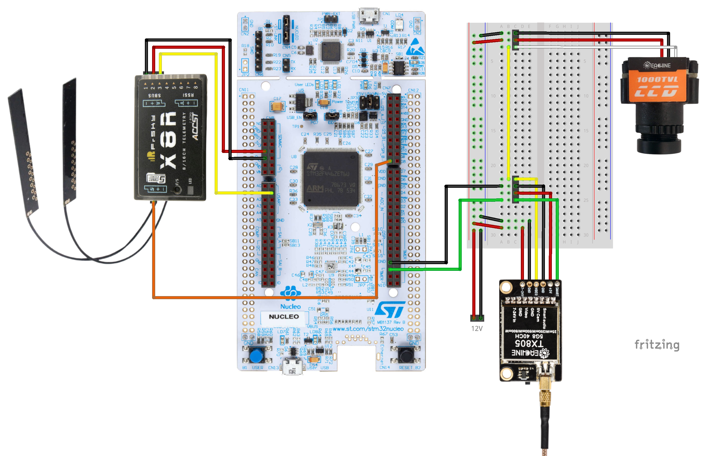
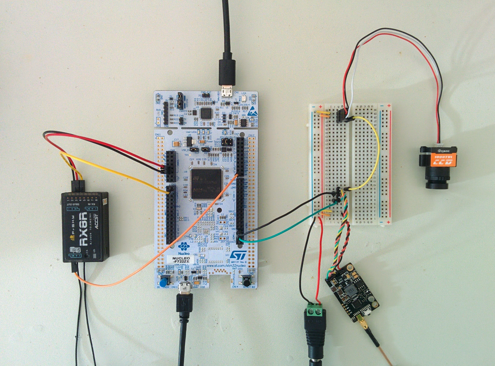
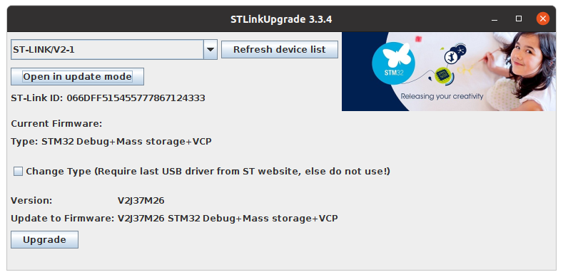
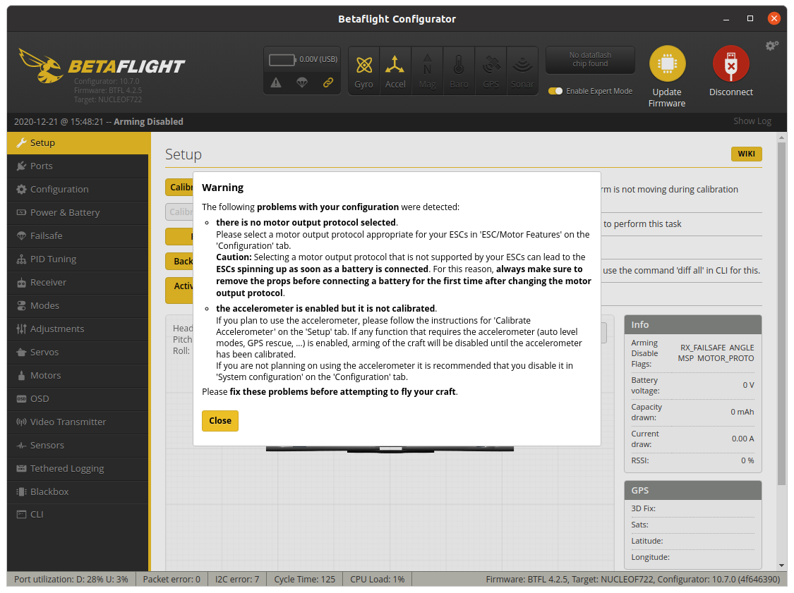
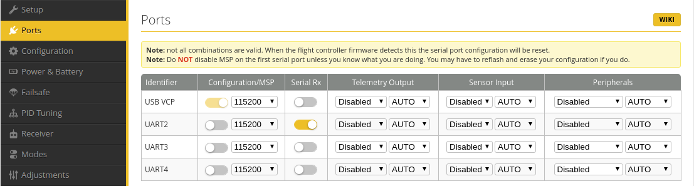
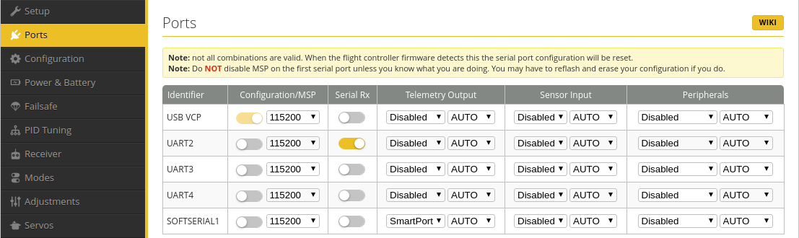
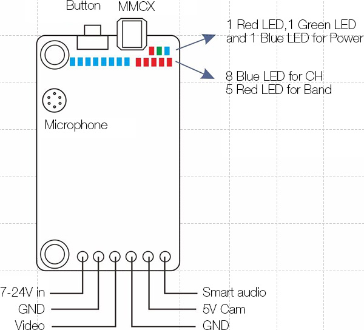

Breadboard SmartAudio control via OpenTX
========================================

This project is about creating a breadboard setup where a standard STM32 Nucleo development board acts as a flight controller that enables a transmitter, running OpenTX, to control a SmartAudio video transmitter via an FrSky X-series receiver.

Parts:

* [Nucleo F722ZE](https://www.st.com/en/evaluation-tools/nucleo-f722ze.html) development board.
* [FrSky X8R](https://www.frsky-rc.com/product/x8r/) receiver (RX).
* [Eachine TX805](https://www.eachine.com/Eachine-TX805-5_8G-40CH-25-or-200-or-600-or-800mW-FPV-Transmitter-TX-LED-Display-Support-OSD-or-Pitmode-or-Smart-Audio-RP-SMA-Female-p-1234.html) video transmitter (VTX).
* [Eachine 1000TVL](https://www.eachine.com/Eachine-1000TVL-1-3-CCD-110-Degree-2.8mm-Lens-Mini-FPV-Camera-NTSC-PAL-Switchable-p-357.html) FPV camera.
* [12V power supply](https://www.reichelt.com/de/en/eco-friendly-plug-in-power-supply-unit-12-v-1500-ma-2-5-mm-snt-1500-12v-2-5-p108993.html) (plus barrel jack to terminal block [adapter](https://www.adafruit.com/product/368)).

All the work below was done using a computer running Ubuntu, but it should be easy enough to adapt things for Mac or Windows.

Wiring
------

Setting up the Nucleo board
---------------------------

The NUCLEO F722ZE has two USB ports - one, labeled _CN1_, on the small subboard at one end and one, labeled _CN13_, on the main board at the other end. The small subboard is the builtin [ST-LINK](https://www.st.com/en/development-tools/st-link-v2.html). 

Aside: Oddly, the two USB connectors use different components - the one on the ST-LINK is clearly a micro-USB connector, the other is also micro-USB but upside-down relative to the other one.

Plug a USB cable into the ST-LINK connector (plugging it into the other one does nothing due to the default jumper settings) - it appears as a USB drive.

The board comes with a pre-installed example application that will flash the red user LED madly, press the button labeled _USER_ to get it to cycle through the other user LEDs.

### Update the ST-LINK firmware

Find the latest ST-LINK updater under the [products section](https://www.st.com/en/development-tools/stm32-programmers.html#products) of STM32 Programmers page. Currently, it's [STWS-LINK007](https://www.st.com/en/development-tools/stsw-link007.html).

Register with the ST site, download the application and run the updater:

    $ cd Downloads
    $ unzip en.stsw-link007_V2-37-26.zip 
    $ cd stsw-link007
    $ cd AllPlatforms
    $ command -v java
    .../bin/java ...
    $ sudo .../bin/java -jar STLinkUpgrade.jar

Note: if you've got the Arduino IDE installed, it includes a version of Java that you can use - you can find `java` in the `java/bin` subdirectory of the IDE's main installation directory.

`sudo` is required so that the application can open USB devices. Once started, the GUI should detect the device, click the _Open in update mode_ and click _Upgrade_ if the _Version_ shown isn't the same as the one shown for _Update to Firmware_.

Installing Betaflight
---------------------

After Betaflight has been installed for the first time, it can be updated via the [Betaflight Configurator](https://github.com/betaflight/betaflight-configurator). But to install it for the first time you have to use the USB drive that shows up when you connect to the ST-LINK subboard via USB (as described above). But first let's build Betaflight locally...

### Building Betaflight

Clone the Betaflight repository:

    $ git clone git@github.com:betaflight/betaflight.git
    $ cd betaflight

Checkout the latest [tag](https://github.com/betaflight/betaflight/tags):

    $ git checkout 4.2.5

The Betaflight Ubuntu build instructions are [here](https://github.com/betaflight/betaflight/blob/master/docs/development/Building%20in%20Ubuntu.md).

It says the first things you should do is:

    $ make arm_sdk_install

All this does is download a tarball for `gcc-arm-none-eabi` into the `downloads` directory and then unpacks it into the `tools` directory.

However, instead of this we can just get `apt` to do this for us:

    $ sudo apt install gcc-arm-none-eabi

Aside: if you've used `gcc-arm-none-eabi` before, you may be wondering if you should be installing it via a non-default PPA. If you're running a recent version of Ubuntu, e.g. 20.04 LTS, then the answer is no. See the [_Notes_](#notes) section below for more details.

Now, it's trivial to build an image suitable for installation on the Nucleo board:

    $ make hex TARGET=NUCLEOF722
    ...
    Creating HEX ./obj/betaflight_4.2.5_NUCLEOF722_afdac08b3.hex
    ...

This makes a hex image for the `NUCLEOF722` target. You can find all possible targets like this:

    $ ls src/main/target
    AG3X  BEEBRAIN_V2F  CRAZYFLIE2  ...

If you want to remove all the object files etc.:

    $ make clean TARGET=NUCLEOF722

Note: if you omit `TARGET=NUCLEOF722` then it will just try to remove object files and the like associated with the default target (which, fairly arbitrarily, is set to `STM32F405`).

The `make` output above showed that it created the hex file `/obj/betaflight_4.2.5_NUCLEOF722_afdac08b3.hex`:

    $ ls -sh obj/betaflight_4.2.5_NUCLEOF722_afdac08b3.hex
    1.2M obj/betaflight_4.2.5_NUCLEOF722_afdac08b3.hex

Now install the hex file on the board - this simply requires copying it to the board's USB drive:

    $ cp obj/betaflight_4.2.5_NUCLEOF722_afdac08b3.hex /media/ghawkins/NODE_F722ZE

The drive unmounts and remounts. After remounting and going through a boot sequence, the board's red and green LEDs are lit and the blue one flashes on and off.

### Using Docker to build Betaflight

An alternative to having to set up a suitable development environment, is to install and use [Docker](https://docs.docker.com/engine/install/).

First download this [Dockerfile](Dockerfile) and:

    $ cd betaflight
    $ cp ~/Downloads/Dockerfile .

At any point you can clean everything with:
 
    $ sudo rm -rf downloads obj tools

Aside: why do you need `sudo`? Because the `Dockerfile` creates files with a different user ID to the current user - this should be fixed.

First step:

    $ docker run --rm --volume $PWD:/betaflight betaflight:latest make arm_sdk_install

Then make sure everything is clean:

    $ docker run --rm --volume $PWD:/betaflight betaflight:latest make clean TARGET=NUCLEOF722

Then build the hex target:

    $ docker run --rm --volume $PWD:/betaflight betaflight:latest make hex TARGET=NUCLEOF722
    $ ls obj/betaflight_4.2.5_NUCLEOF722_afdac08b3.hex

Using Betaflight Configurator
-----------------------------

Now that Betaflight is installed, Betaflight Configurator can be used to configure things.

Download the latest Betaflight Configurator from [releases](https://github.com/betaflight/betaflight-configurator/releases). Then...

    $ mv ~/Downloads/betaflight-configurator_10.7.0_amd64.deb /tmp
    $ cd /tmp
    $ sudo apt install ./betaflight-configurator_10.7.0_amd64.deb

Aside: moving things into `/tmp` just avoids `apt` issues over who owns the containing directory (the user who downloaded the `.deb` file or the root user running `apt install`).

The Configurator ends up in `/opt/betaflight/betaflight-configurator`:

    $ apt list --installed | fgrep -i betaflight
    betaflight-configurator/now 10.7.0 amd64 [installed,local]
    $ dpkg-query -L betaflight-configurator
    ...
    /opt/betaflight/betaflight-configurator/betaflight-configurator
    ...

So far we've been communicating with the board via the USB connector on ST-LINK subboard. However, the Configurator needs to communicate with the board via the other USB connector. So keep the board powered via the ST-LINK and plug in another USB cable to the second USB connector.

The [_Notes_](#notes) section covers creating a `udev` rule for this second USB connector. Assuming you've got it set up such that you don't need to use `sudo` to access it, you can start the Configurator:

    $ /opt/betaflight/betaflight-configurator/betaflight-configurator

If you leave it for a second or two, it automatically detects the correct values for the two serial port related dropdowns left of the _Connect_ button:

With the `udev` rule you can always see which is the right port:

    $ ls -l /dev/stm-virtual-com 
    lrwxrwxrwx 1 root root 7 Dec  8 17:34 /dev/stm-virtual-com -> ttyACM1

Note: when you power up, restart or reboot the board, you have to wait for the board to fully start up for the Configurator to be able to detect the correct port. The board is ready it turns on the green user LED - when this happens the Configurator almost instantly correctly detects it.

Click the _Connect_ button and ignore the warning about the _motor output protocol_ and the _accelerometer_.

Now you can update the firmware via the Configurator rather than copying it on via the ST-LINK.

Nucleo pinout
-------------

Now, we're going to start wiring things up to the Nucleo board. To do this we need a pinout diagram for the board's headers (there are two rows of headers and each row is in turn split into an upper and lower part, these parts are named CN7, CN8, CN9 and CN10).

Unfortunately there don't seem to be any really nice pinout diagrams for the board, the best is the one that you can find in the user manual that you can download from the [documentation section](https://www.st.com/en/evaluation-tools/nucleo-f722ze.html#documentation) of the board's page on the ST site. The diagram in the _Hardware layout and configuration_ section of the manual is just the same as the one that comes with the board's blister pack.

The silkscreen on the board itself isn't very helpful as the pins are laid out to be very similar to the Arduino UNO headers and given names that correspond to the pin names on the UNO rather than their real STM32 names.

Initially, I referred to some pins here by their silkscreened names but this turns out to be very confusing. E.g. the silkscreened A0 corresponds to the similarly positioned A0 on an Arduino UNO. However, the STM32 also has an A0 pin (referred to as PA0 in the Nucleo manual and as A00 within Betaflight Configurator) that is totally unrelated to this silkscreened pin A0.

**Important:** each header consists of two rows of pins (unlike the Arduino UNO with its single rows) - initially I incorrectly assumed that the two rows were just the same pins doubled up. The pins on the inner and outer rows are completely distinct.

You can find how pins are assigned for a particular Betaflight target in its `target.h` file, in our case this is [`src/main/target/NUCLEOF722/target.h`](https://github.com/betaflight/betaflight/blob/master/src/main/target/NUCLEOF722/target.h). E.g. there, you'll see:

    #define USE_UART2
    #define UART2_RX_PIN PD6
    #define UART2_TX_PIN PD5

So the UART2 RX and TX pins are PD6 and PD5 respectively. If you look at the pin out diagram in the user manual (or the one that came in the board's blister pack), you'll find these pins near the top-right of the CN9 header.

Setting up the RX
-----------------

Now we know where the UART2 RX pin is - let's use it to connect the RX to the board.

Connect the ground and power pins of the RX's S.BUS port to the 5V and GND pins on the CN8 header and connect the S.BUS signal pin to PD6.

Note: the RX takes 5V and the VTX takes 12V but all signal pins on both are 3.3V safe.

In the Configurator, go to the _Ports_ tab and click the _UART2_ _Serial RX_ toggle to on. All other settings for _UART2_ should be left unchanged, e.g. the _Configuration/MSP_ toggle should be left unselected, i.e. off.

Click _Save and Reboot_. Once you've reconnected, go to the _Configuration_ tab and under _Other Features_ select _Telemetry_ and click _Save and Reboot_ again.

Aside: according to some sources, you shouldn't need to save and reboot twice, but it's unclear to me if it always remembers unsaved changes from one tab when you switch to another.

**Credit:** these instructions are derived from Oscar Liang's instructions for the F3 [here](https://oscarliang.com/sbus-smartport-telemetry-naze32).

Note: Oscar mentions settings in the _Receiver_ section of _Configuration_ but for this setup they already had the appropriate values.

Binding the RX 
--------------

On my OpenTX transmitter, I created a new model - all I did was give it a name and bound it to the RX as described [here](https://george-hawkins.github.io/arf-drone/docs/binding).

No other settings are needed but to stop the transmitter complaining about no failsafe being set when it starts up, go to the model's _SETUP_ page, scroll to _Failsafe_ and set it to _No pulses_ (which with a real drone would mean you then need to configure how to respond in a failsafe situation of the flight controller itself).

Once the transmitter is bound to the RX, go to the _Receiver_ tab in the Configurator and confirm that the bars move as you move the sticks on the transmitter.

Telemetry
---------

Now, we're going to set up telemetry, i.e. connect a pin on the board to the signal pin of the RX's S.PORT connector and configure the flight controller to output telemetry data to this pin.

Rather than a real UART we're going to use SoftSerial for this.

TODO: work out which of S.BUS, S.PORT and SmartAudio have the lowest bit-rate and use SoftSerial for whichever it is.

For SoftSerial we first need a pin for it to use (for telemetry, we only need a TX pin), the usual thing to do is to steal a pin from something that isn't being used. With the Nucleo board there are lots of pins that aren't assigned to anything which you could probably be used instead. But we'll do things the normal way and steal a currently assigned pin.

In Configurator, go to the CLI and:

    # resource
    ...
    resource MOTOR 5 E06
    resource MOTOR 6 B04
    resource PPM 1 B15
    ...

The pins suggested for stealing in Oscar's [guide](https://oscarliang.com/betaflight-resource-remapping/) are `LED_STRIP`, `PPM` and spare motor outputs. There's no `LED_STRIP` resource for this board so let's use the last motor output, i.e. `MOTOR 6` (not that we're intending to ever use 1 to 5).

First free it (this isn't really necessary, but it stops Betaflight complaining when we reassign the pin next):

    # resource MOTOR 6 none
    Resource is freed

And assign it to SoftSerial and save:

    # resource SERIAL_TX 11 B04
    Resource is set to B04
    # save

Note: SoftSerial port number starts from 11, `SERIAL_TX 11` being SoftSerial #1 and 12 being SoftSerial #2.

Once it has rebooted and you've reconnected go to the _Configuration_ tab and under _Other Features_ turn on _SOFTSERIAL_.

After _Save and Reboot_ go to ports and _SOFTSERIAL1_ should now be there (if not go to the `tlm_halfduplex` section of Oscar's guide, at this stage, I'm not sure if I had to actively change anything related to this).

TODO: reset are parameters and re-setup SoftSerial and see if `tlm_halfduplex` is relevant - I doubt it.

Now, set the _Telemetry Output_ value for _SOFTSERIAL1_ to _SmartPort_ and _Save and Reboot_.

Once everything was set up, I connected the S.PORT signal pin of the RX to pin PB4 on the Nucleo board (the bottom-left pin on header CN7).

Note: using `resource` above the pin is called B04, but this isn't the name used in the Nucleo user manual or in `target.h`. Mapping between the two naming conventions is simple enough, e.g. take `B04`, knock out any leading zeros to get B4 and then prepend "P" to get PB4.

After a lot of experimenting, I finally got telemetry working by going to the _CLI_ tab and entering:

    # set tlm_inverted=OFF
    # set tlm_halfduplex=ON
    # save

After this, I could go to the _TELEMETRY_ page for my model, on the transmitter, and select _Discover new sensors_. In addition to RSSI and RxBt (which come directly from the RX and are available even if telemetry hasn't been set up as described above), it discovered an array of additional sensors - i.e. all those listed [here](https://github.com/betaflight/betaflight/blob/master/docs/Telemetry.md#available-sensors) for Betaflight.

Note: the setting `tlm_inverted` seems a little confusing. The S.PORT signal is an inverted serial signal and F3 and F7 STM32 MPUs can handle this inversion but MPUs like the F4 require and external inverter. So `tlm_inverted` is not about the inverted nature of the underlying S.PORT signal but about whether it has been inverted again (to become uninverted) by an external inverter. For this F7 based board an external inverter is unnecessary so `tlm_inverted` is set to `OFF`.

Hardware UART pins
------------------

You can skip over this section, it just covers my experimentation with hardware UART pins.

You don't appear to have much (any?) freedom to assign pins to UARTs (as e.g. you do with the ESP32). I couldn't work out the scheme to what is and isn't allowed.

In `target.h` various pins are assigned to UARTs 5, 6, 7 and 8 but those UARTs are not actually enabled.

Of the pins assigned to those UARTs, only pins PE8 (TX) and PE7 (RX) of UART7 and pin PE0 (RX) of UART8 are actually pins exposed via the Nucleo header.

Of the UARTs that are actually enabled, i.e. UART2, UART3 and UART4, only pins PD6 (RX) and PD5 (TX) of UART2 and pin PA0 (TX) of UART4 are exposed.

I could use UART4 (with pin PA0) for _SmartPort_ telemetry, but I could not e.g. use PE8 by reassigning it to UART3. This _may_ be because UART3 is used for ST-LINK (search for _USART3_ in the F722ZE manual) - this assumes there's some connection between Betaflight's UART numbering and the devices of the MPU but I don't believe there is.

I also tried reassigning UART4 TX to other pins but this didn't work either.

In the manual's _Hardware layout and configuration_ section for the F722ZE, the pins PD6 and PD5 are described as being the RX and TX pins of _USART_2_ and indeed are used as the RX and TX pins of UART 2 in `target.h`.

However, the only other pins described as _USART_ pins are PG14 (TX) and PG9 (RX) for _USART6_ (notice the inconsistent naming _USART_2_ vs _USART6_) and these pins are out of bounds to the Betaflight CLI as it doesn't recognise pin names about F15.

The PA0 pin, i.e. UART4 TX, is not described as a UART pin in the F722ZE manual - there it's described as having signal name `TIMER_C_PWM1` and function `TIM2_CH1`.

So one might imagine that a pin with a similar name and function, e.g. PB0 (with signal name `TIMER_D_PWM1` and function `TIM3_CH3`), could be substituted for PA0 but it cannot. Neither can PE9 (`TIMER_A_PWM1` and `TIM1_CH1`) nor PE8 (assigned to UART7 TX in `target.h`).

I tried reassigning PA0 to UART3, but it doesn't work there. And I tried assigning it to SoftSerial (replacing B04 used above) and that didn't work there either.

One might imagine that despite seeming to be able to set `resource` values for UARTs via the CLI that this doesn't actually change anything. However, this is not the case - changes to UART pins via `resource` do affect things, e.g. if you assign PA0 to UART3 but leave _SmartPort_ set for UART4 (and nothing set for UART3), it's not the case that things keep on working, i.e. it's not that under the covers UART4 is still really using PA0 as if it hadn't been reassigned to UART3.

So what exactly the rules are here is quite unclear.

Telemetry on a hardware UART TX pin
-----------------------------------

Having set up telemetry via SoftSerial, I also wanted to see that it worked the same way using a hardware UART TX pin.

After all the experimentation covered in the previous section on hardware UART pins, it turns out that only PA0 - the TX pin for UART4 - works.

It was trivial to swap the _SmartPort_ telemetry setting from the SoftSerial port to UART4 using the Configurator and switch the telemetry hookup wire from pin PB4 to PA0 (near lower-left of CN10).

Using a hardware UART doesn't introduce any increased flexibility with regards `tlm_halfduplex` and `tlm_inverted` - they have to be the same values as they were above for SoftSerial.

SmartAudio
----------

I could connect the RX directly to the Nucleo board. Setting up the VTX and camera involved a bit more set up and a breadboard as the VTX requires 12V and involves rather more pins.

**Important:** always connect the aerial of a VTX before you power it up - if you don't the VTX will quickly overheat and power itself off (if you're lucky) or burn itself out.

I connected the red and black voltage-in wires to power provided via a 12V adapter. I also connected the FPV camera to the 12V supply. Often, you can power the camera directly off the VTX (see the _5V Cam_ and _GND_ pins in the diagram). However, this camera could handle 12V and it wasn't clear to me that the VTX could provide enough current for this particular camera.

Note: the VTX defaulted to outputting at 600mW (blue LED on). At this power level the VTX very quickly becomes extremely hot, i.e. hot enough to be painful to touch. Switching it down to 25mW brings it within legal limits (and is anyway the nice thing to do in a non-outdoors situation where you don't want to interfere with your neighbors WiFi). At 25mW, it runs substantially cooler.

I connected the _Video_, _GND_, _5V Cam_ and _SmartAudio_ wires to a small piece of male header and plugged it into the breadboard. Then, via the breadboard, I connected the video signal from the camera to the _Video_ pin of the VTX.

Aside: with a proper flight controller, you'd connect the video pin of the camera to the flight controller and then connect the flight controller to the VTX - this would allow the flight controlled to overlay what's called an OSD (on-screen display) onto the video signal. However, the Nucleo board has no OSD hardware, so it cannot do this.

Then (after restoring telemetry to SoftSerial pin PB4) I connected the SmartAudio pin on the VTX to pin PA0 on the Nucleo board, i.e. the UART4 TX pin. And I connected the _GND_ pin (beside _5V Cam_) to a ground pin on the Nucleo board - conveniently there's one just above the PA0 pin.

**Important:** initially, I didn't connect the VTX ground pin to a ground pin on the Nucleo board. I didn't think this was necessary - I naively assumed that as the 5V source for the Nucleo board and the 12V power adapter were both ultimately powered off the same A/C source that they would have the same ground. This is not the case, relative to the ground of the Nucleo board the voltage seen when connecting the SmartAudio pin the Nucleo board was permanently at around 3.3V (it's not possible for me to tell if it was above 3.3V, just that it was at the max, luckily the pins involved were not damaged) rather than an oscillating signal going between 0 and 3.3V. After a lot of frustration, it simply required connecting the ground pins as described to resolve this issue.

Then, once things were wired up, I followed Oscar Liang's [guide](https://oscarliang.com/vtx-control/) and set things up in the Configurator:

* Under the _Ports_ tab, I set the _Peripherals_ drop down for _UART4_ to _VTX (TBS SmartAudio)_ (and clicked _Save and Reboot_).
* Under the _Other Features_ section of the _Configuration_ tab, I toggled _OSD_ to on (and clicked _Save and Reboot_).

The second step proved pointless - as mentioned above the OSD depends on the video signal being routed via a flight controller that has the necessary OSD hardware.

Then continuing with Oscar's guide I went about setting up the _VTX table_. First, I determined the SmartAudio version using the Configurator (as described in the video linked to from the Betaflight _VTX Tables_ [wiki page](https://github.com/betaflight/betaflight/wiki/VTX-tables)) like so:

* Under the _Blackbox_ tab, I set the _Blackbox debug mode_ to _SMARTAUDIO_ (and clicked _Save and Reboot_).
* Then I toggled _Enable Expert Mode_ to on (it's to the left of the _Update Firmware_ and _Connect_ buttons).
* Then under the _Sensors_ tab, I unselected everything already selected (_Gyroscope_ and _Accelerometer_) and selected only _Debug_.

The value I saw for _Debug 0_ was 216 - which correspond to the value for "SA 2.0 unlocked" shown in the wiki page (rather than the values mentioned in the video).

**Note:** if PR [#10413](https://github.com/betaflight/betaflight/pull/10413) (and its related Configurator PR) are merged, you'll be able to see the SmartAudio version directly in the VTX tab without all this debug stuff.

Aside: see the [_Notes_](#notes) for more on the values that you see in the _Debug 1_ and _Debug 2_ channels.

So given that my VTX is SmartAudio 2.0, I downloaded the _SmartAudio 2.0 (EU)_ JSON file from the _VTX Tables_ wiki page and loaded it in the Configurator by going to the _Video Transmitter_ tab, selecting _Load from file_ and, once it was loaded, selecting _Save_.

It looks like in the EU, you can't have frequencies below around 5732 and above around 5866, so the top A band channel is unavailable as are the lower two and higher two race band channels (and so show as having value 0). Band E is not legal in the EU, hence it appears as _UNKNOWN_ between bands B and F.

I reduced the number of bands to 5 (and then pressed _Save_) to knock out the I band that isn't mentioned in the TX805 mini-manual. Other than that everything lined up with the table of frequencies in the manual.

Note: Oscar Liang sets up the VTX table using the CLI - I don't see the point in doing this as the file based approach works well.

Aside: under _Video Transmitter_ tab, you can select _Save LUA Script_ which saves a file, that describes the frequencies table, and can, apparently, be loaded into OpenTX. However, I don't know why you would do this as the Betaflight script on the transmitter can download this table from the flight controller via the RX using the MSP protocol.

Now one can control the VTX via the _Selected Mode_ section of the _Video Transmitter_ tab. E.g. select band _BOSCAM_A_, channel _Channel 1_ and power _25_ and press _Save_ and you'll see the LEDs change accordingly on the VTX.

Transmitter setup
-----------------

Assuming you've got your transmitter and receiver upgraded to the latest OpenTX firmware releases (in the case of the transmitter and its bootloader) and FrSky firmware releases (in the case of the receiver and the transmitter's internal radio module) then, following the Betaflight TX Lua Scripts [instructions](https://github.com/betaflight/betaflight-tx-lua-scripts#installing), you just need to:

* Download the latest zip file from the releases [page](https://github.com/betaflight/betaflight-tx-lua-scripts/releases).
* Mount the _OPENTX_ SD card and...

    $ cd ~/Downloads/
    $ unzip betaflight-tx-lua-scripts_1.5.0.zip 
    $ cd obj
    $ cp -r * /media/$USER/OPENTX
    $ ls /media/$USER/OPENTX/SCRIPTS/TOOLS
    bf.lua ...

If `bf.lua` is there, as shown, then all is good.

Aside: `obj` seems an odd name for the root directory of the extracted zip file.

Once the transmitter is restarted, long press _MENU_, this takes you to the _TOOLS_ page. Scroll down and select _Betaflight setup_, the first time it runs it goes through a one-time setup process, once this has happened select _Betaflight setup_ again. Now when you select it, it will display _Downloading VTX tables_ for a while. It does this by communicating with the flight controller using MSP (MultiWii Serial Protocol).

Aside: MSP seems to be rather poorly documented, if you're interested, you can find the protocol described [here](http://www.multiwii.com/forum/viewtopic.php?f=8&t=1516) and the Betaflight implementation [here](https://github.com/betaflight/betaflight/tree/master/src/main/msp).

This line in the [README](https://github.com/betaflight/betaflight-tx-lua-scripts/blob/master/README.md) took me a while to work out:

> If you change the VTX table, you have to re-load the updated VTX table in the script, by choosing the 'vtx tables' option in the function menu.

If you update the VTX tables in Betaflight Configurator then on your transmitter go to _TOOLS_ / _Betaflight setup_ / _VTX Settings_ and then press and hold _ENTER_, this will bring up a popup menu where one of the options is _vtx tables_ - simply select it and the VTX table (with your updates) will be re-downloaded.

You can reach this popup menu (what they call the _function menu_) from any of the subpages of _Betaflight Config_, e.g. _VTX Settings_, _PIDs 1_ etc., but not from the main page itself.

The menu items of the popup are:

* _save page_ - any changes you make on a page, e.g. to the _Band_ etc., are only actually applied after you select _save page_.
* _reload_ - reload the value displayed on the page from the flight controller.
* _reboot_ - reboot the flight controller.
* _vtx tables_ - described above. 

Note: once upon a time it was possible to configure things such that one could interact with the Betaflight script via the OpenTX telemetry screens and this is covered in many existing tutorials. This in no longer possible - you can only access it now via the _TOOLS_ page (as just described) - for more details see issue [#306](https://github.com/betaflight/betaflight-tx-lua-scripts/pull/306). This change came with version 1.5.0 (released in May 2020) of the scripts.

Now everything is set up, you can change _Band_ etc. under _VTX Settings_. As already noted, your changes only come into effect when you long press _ENTER_ and select _save page_. You can change everything except the _Protocol_ value (which is set to _SA_, i.e. SmartAudio).

Aside: once this is all set up, one essentially gives up the ability to configure the VTX by its push button. You can still change VTX settings via the push-button but then, in OpenTX, if you press _reload_ via the _function menu_, nothing changes. And if you reboot the flight controller it will restore the settings on the VTX to those seen under _VTX Settings_. So it seems that while there is two-way communication between the flight controller and the transmitter, the flight controller only sets values for the VTX but doesn't try to read them. As we saw above, we can read the Smart Audio version from the VTX so there does seem to be two-way communication between the flight controller and the VTX - but the flight controller simply doesn't use this capability to update its values, for band etc., to values set via the VTX.

Note: if you're on the Configurator _Video Transmitter_ tab and you change the settings via OpenTX then you have to switch to another Configurator tab and then back to _Video Transmitter_ to force it to load the changes, there's no equivalent of the OpenTX _reload_ menu option in Configurator.

See the [_Notes_](#notes) for a discussion of pit mode, i.e. the ultra-low power mode that's below even 25mW.

X8R ports
---------

For this setup, we're just interested in the S.PORT and the S.BUS ports. You can see the plus, minus and signal pins shown in the little graphic for each port on the top of the RX.

TX805 manual
------------

The TX805 doesn't come with much of a manual and some of it is a bit incoherent or just incorrect (e.g. the power pins LEDs stay lit rather than flickering on and then off as). And oddly Eachine doesn't make its manuals available for download as PDFs - so here is a (rather poor) scan of it:

Notes
-----

Miscellaneous notes related to various things above.

### Creating a udev rule for the Nucleo board

If you're already a member of the `dialout` group, you may well not need to do anything special to be able to access the non-ST-LINK USB port on the Nucleo board.

But let's go through creating a comprehensive rule for the board. First we need the details that are output to `syslog` when the USB cable is plugged in:

    $ tail -f /var/log/syslog
    Dec  8 17:11:52 systemd[1490]: Started VTE child process 30338 launched by gnome-terminal-server process 2758.
    Dec  8 17:15:03 kernel: [12304.704318] usb 3-4.4: new full-speed USB device number 10 using xhci_hcd
    Dec  8 17:15:03 kernel: [12304.806319] usb 3-4.4: New USB device found, idVendor=0483, idProduct=5740, bcdDevice= 2.00
    Dec  8 17:15:03 kernel: [12304.806322] usb 3-4.4: New USB device strings: Mfr=1, Product=2, SerialNumber=3
    Dec  8 17:15:03 kernel: [12304.806323] usb 3-4.4: Product: STM32 Virtual ComPort in FS Mode
    Dec  8 17:15:03 kernel: [12304.806323] usb 3-4.4: Manufacturer: Betaflight
    Dec  8 17:15:03 kernel: [12304.806324] usb 3-4.4: SerialNumber: 3986356B3037
    Dec  8 17:15:03 kernel: [12304.814015] cdc_acm 3-4.4:1.0: ttyACM1: USB ACM device
    Dec  8 17:15:03 mtp-probe: checking bus 3, device 10: "/sys/devices/pci0000:00/0000:00:14.0/usb3/3-4/3-4.4"
    Dec  8 17:15:03 mtp-probe: bus: 3, device: 10 was not an MTP device
    Dec  8 17:15:03 snapd[691]: hotplug.go:199: hotplug device add event ignored, enable experimental.hotplug
    Dec  8 17:15:03 mtp-probe: checking bus 3, device 10: "/sys/devices/pci0000:00/0000:00:14.0/usb3/3-4/3-4.4"
    Dec  8 17:15:03 mtp-probe: bus: 3, device: 10 was not an MTP device
    Dec  8 17:15:06 ModemManager[779]: <info>  Couldn't check support for device '/sys/devices/pci0000:00/0000:00:14.0/usb3/3-4/3-4.4': not supported by any plugin

This shows that both the `ModemManager` and `mtp-probe` try to access the device. We want a rule that:

* Tells `ModemManager` and `mtp-probe` to ignore the device.
* Makes the device accessible by any user without using `sudo`.
* Creates a soft-link to the device with the name `stm-virtual-com`.

Even if one doesn't use the soft-link directly, e.g. in Betaflight Configurator, it's always useful to be able to see which `/dev` file has been assigned to our device when it's plugged in:

    $ ls -l /dev/stm-virtual-com 
    lrwxrwxrwx 1 root root 7 Dec 21 14:00 /dev/stm-virtual-com -> ttyACM0

The important line in the log output that identifies the device is:

    kernel: [12304.806319] usb 3-4.4: New USB device found, idVendor=0483, idProduct=5740, bcdDevice= 2.00

If you look up the `idVendor` and `idProduct` values [here](https://usb-ids.gowdy.us/read/UD/) on the USB ID repository you can see that this is a virtual COM port from ST.

Using these values, we can now create a rule for the device:

    # STM - virtual COM port.
    SUBSYSTEM=="tty", ATTRS{idVendor}=="0483", ATTRS{idProduct}=="5740", \
        SYMLINK+="stm-virtual-com", MODE="0666"

    ATTRS{idVendor}=="0483", ATTRS{idProduct}=="5740", ENV{ID_MM_DEVICE_IGNORE}="1"

    ATTRS{idVendor}=="0483", ATTRS{idProduct}=="5740", ENV{MTP_NO_PROBE}="1"

Just create a file called `/etc/udev/rules.d/50-serial-ports.rules` containing these lines or if the file already exists just copy them into the file. There's nothing important about the filename, what's important is that exists under `/etc/udev/rules.d` and that it conforms to the naming convention `<number>-<name>.rules` (where `<number>` is anything from `00` to `99`).

That's it - nothing needs to be restarted or informed about these changes - they'll be read next time a device is plugged in.

### GNU Arm Embedded Toolchain

Many older tutorials on ARM development cover adding an additional PPA in order to install `gcc-arm-none-eabi`.

Originally, the latest version of `gcc-arm-none-eabi` was released via a PPA maintained by [Terry Guo](https://launchpad.net/~terry.guo).

Then in late 2015, releases were moved to the "GCC Arm Embedded Maintainers" team PPA (see this [announcement](https://launchpad.net/gcc-arm-embedded/+announcement/13824)).

However, no new releases have been made available via this PPA since 2018 (the last release being for 18.04 LTS).

In 2016, ARM decided to move from using Lauchpad to managing everything from arm.com domains (see this [announcement](https://launchpad.net/gcc-arm-embedded/+announcement/14244)).

The main site for the toolchain is now the GNU Arm Embedded Toolchain [subsite](https://developer.arm.com/tools-and-software/open-source-software/developer-tools/gnu-toolchain/gnu-rm) on Arm Developer.

And finally, the `gcc-arm-none-eabi` [package](https://packages.ubuntu.com/focal/gcc-arm-none-eabi) available for Focal (20.04 LTS) and later releases, via the standard Ubuntu PPAs, is based directly on the packages released by ARM and there is no need to add any additional PPA in order to install it.

### Minor Betaflight issue

Betaflight Configurator allows you to e.g. configure _Serial RX_ and _SmartPort_ on a single UART but this doesn't work. As I understand it, S.BUS and S.PORT use different bit rates so this is hardly surprising? When you reboot the board the _SmartPort_ becomes unset if you tried to set it on a port already configured for _Serial RX_ but ideally Configurator would stop you doing this kind of thing in the first place.

### Voltages

I don't really understand why connecting ground pins on the VTX and Nucleo board  works. If the ground of one source is higher than the ground of the other why does ground level out when the grounds of the two sources are connected? And why doesn't the 3.3V of one source remain raised relative to the other ground, i.e. look like something greater that 3.3V to things connected to the other source.

Note that the Nucleo manual clearly says:

> Caution:1 The I/Os of STM32 microcontroller are 3.3 V compatible instead of 5 V for ARDUINO&reg; Uno V3.

### SmartAudio debug channels

Above, the SmartAudio version was determined using the _Debug 0_ channel. Oscar's summary of the values in this [post](https://intofpv.com/t-what-smartaudio-version-do-i-have) also covers what you see in the _Debug 1_ and _Debug 2_ channels.

If I adjust the band on the VTX then I see the following _Debug 1_ values depending on the band:

* Band = 1, Debug 1 = 0
* Band = 2, Debug 1 = 15
* Band = 3, Debug 1 = 23
* Band = 4, Debug 1 = 31
* Band = 5, Debug 1 = 39

Changing the channel should have changed the output of _Debug 2_, but it seemed to stay stuck at just one value.

### Retrieving values via the Betaflight CLI

You can just enter part of a value name and get all values containing that substring:

    # get vtx_
    osd_vtx_channel_pos = 234
    Allowed range: 0 - 15359

    vtx_band = 1
    Allowed range: 0 - 8
    Default value: 0

    vtx_channel = 1
    Allowed range: 0 - 8
    Default value: 0

    vtx_power = 1
    Allowed range: 0 - 7
    Default value: 0

    vtx_low_power_disarm = OFF
    Allowed values: OFF, ON, UNTIL_FIRST_ARM

    vtx_freq = 5865
    Allowed range: 0 - 5999
    Default value: 0

    vtx_pit_mode_freq = 0
    Allowed range: 0 - 5999

    vtx_halfduplex = ON
    Allowed values: OFF, ON

### Pit mode

Strangely, it doesn't seem to be possible to configure the VTX to start in pit mode without going via the OSD (which our setup doesn't have).

My VTX is a SmartAudio 2.0 device, it was only with SmartAudio 2.1 that it became possible to actively enter pit mode, previous to that you could only configure the device such that it would start in pit mode.

To do this one should set `RACE` mode (not to be confused with the race band) via the OSD as described [here](https://github.com/betaflight/betaflight/wiki/Unify-Smartaudio#op-model). According to some source you have to power cycle the VTX straight after setting the `OP MODEL` to `RACE` or it'll be forgotten.

However, as this setup doesn't have an OSD, this isn't possible. Oddly, while one can do nearly everything, that one can do via the OSD, using the CLI or Configurator, it doesn't seem possible to set the `OP MODEL`. I've asked about this on RcGroups [here](https://www.rcgroups.com/forums/showthread.php?3787149) and on the Betaflight Slack channel [here](https://betaflightgroup.slack.com/archives/C3D7R2J0P/p1608487449360200).

### Pins

With a bit of grepping, we can track where it appears in the source. E.g. pin PE13 is found in the following places relevant to an F7 board like the one used here:

    src/main/target/NUCLEOF722/target.h:#define SPI4_MISO_PIN PE13

    src/main/drivers/io_def_generated.h:# define DEFIO_TAG__PE13 DEFIO_TAG_MAKE(DEFIO_GPIOID__E, 13)
    src/main/drivers/io_def_generated.h:# define DEFIO_TAG_E__PE13 DEFIO_TAG_MAKE(DEFIO_GPIOID__E, 13)
    src/main/drivers/io_def_generated.h:# define DEFIO_REC__PE13 DEFIO_REC_INDEXED(BITCOUNT(DEFIO_PORT...

    src/main/drivers/timer_stm32f7xx.c: DEF_TIM(TIM1, CH3, PE13, TIM_USE_ANY, 0, 0),
    src/main/drivers/bus_spi_pinconfig.c: { DEFIO_TAG_E(PE13), GPIO_AF5_SPI4 },
    src/main/drivers/timer_def.h:#define DEF_TIM_AF__PE13__TCH_TIM1_CH3 D(1, 1)
